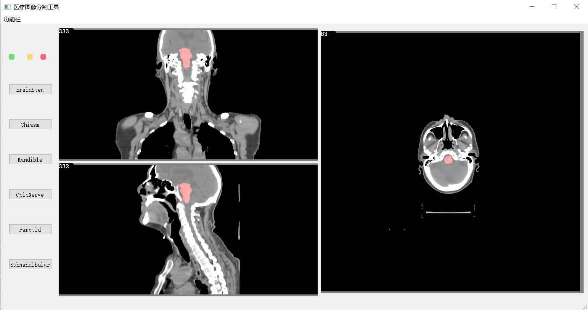

***该项目现只实现了基本功能，现在可以显示DCM格式的图像序列，进行脑干的分割并显示。在多类器官分割和GUI交互方面还未完善***

 

#### 效果演示
点击`功能栏->导入->选择dcm序列文件中的一个dcm文件`。等待几秒钟可完全导入，用滚轮切换dcm切片。

 

由于是**未完成项目**，分割操作比较反人类，点击`功能栏->导入->选择dcm序列文件中的一个dcm文件`，之后不要点击分割，等分割结束后会在当前目录下生成每一层的.npy分割文件，之后再点击`功能栏->分割`。

