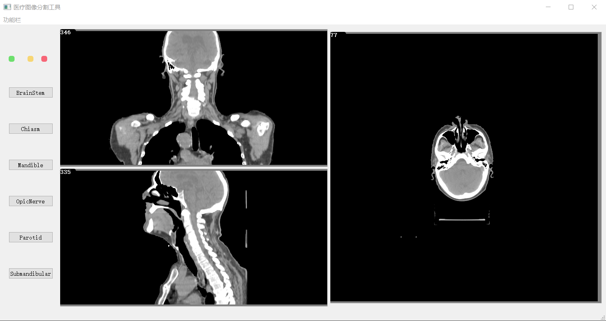

 

## Results
### Display CT slices in three views
Click`功能栏->导入->选择dcm序列文件中的一个dcm文件`。Wait for sceconds till the DCM file is fully loaded, use mouse wheel to switch different slices.

 

### Show the segment results
Click`功能栏->分割`，an .npy file that stores all segment results is saved in `./`，then organ in the left column to show segment results.

